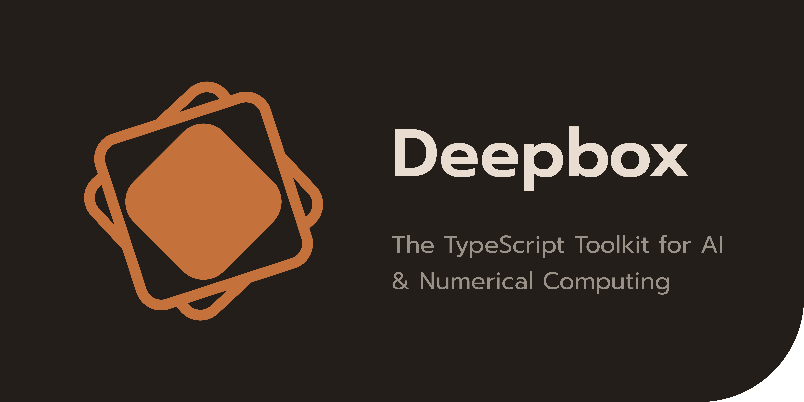

# Deepbox

## The TypeScript Toolkit for AI & Numerical Computing

[](https://github.com/jehaad1/Deepbox/actions/workflows/ci.yml)
[](https://www.npmjs.com/package/deepbox)
[](LICENSE)
<!--
[](https://bench.deepbox.dev)
-->

Deepbox is a zero-runtime-dependency TypeScript framework for tensors, linear algebra, tabular data, machine learning, neural networks, statistics, datasets, and plotting. It is designed for users who want one coherent toolkit instead of stitching together separate numerical and ML libraries.

> Docs: [deepbox.dev/docs](https://deepbox.dev/docs)
> Examples: [deepbox.dev/examples](https://deepbox.dev/examples)
> Projects: [deepbox.dev/projects](https://deepbox.dev/projects)
<!--
> Benchmarks: [bench.deepbox.dev](https://bench.deepbox.dev)
-->

## Why Deepbox

- Zero runtime dependencies
- ESM and CommonJS builds with bundled type declarations
- Stable subpath exports for each major module
- Broad numerical surface area in a single package
- **315** implementation files under `src/**/*.ts` excluding `*.d.ts`, **421** Vitest files matching `test/**/*.test.ts`, **8,686** tests, 50 example directories, and 9 end-to-end projects in the current `v1.0.0` tree (other files under `test/` are helpers or benches, not counted here)

## Requirements

- Node.js `>= 24.13.0` as declared in `package.json` `engines`. Deepbox 1.x is built and CI-tested on Node 24.x with a TypeScript `ES2024` target; use this line for predictable behavior. Older Node versions are not supported for 1.x.

## Installation

```bash
npm install deepbox
```

## Import Model

Deepbox is organized around subpath exports. Prefer importing named APIs from the module you actually use:

```ts
import { tensor, parameter } from "deepbox/ndarray";
import { LinearRegression } from "deepbox/ml";
import { DataFrame } from "deepbox/dataframe";
```

The root package exports namespaces, not direct named symbols:

```ts
import * as db from "deepbox";

const x = db.ndarray.tensor([1, 2, 3]);
const model = new db.ml.LinearRegression();
```

## Quick Start

### Tensors and Autograd

```ts
import { parameter, tensor } from "deepbox/ndarray";

const x = parameter([
  [1, 2],
  [3, 4],
]);
const w = parameter([[0.5], [0.25]]);

const y = x.matmul(w).sum();
y.backward();

console.log(x.grad?.toString());
console.log(w.grad?.toString());

const plain = tensor([1, 2, 3]);
console.log(plain.toString());
```

### GPU and WASM Acceleration

Tensors carry a device (`cpu`, `webgpu`, `wasm`). With a registered backend the
accelerated op set executes on the device; ops a device cannot run throw a
`DeviceError` with a transfer hint instead of silently computing elsewhere.

The WebGPU device set is training-complete: element-wise arithmetic and
activations (incl. `gelu`, `erf`, `rsqrt`, `where`), matmul and **batched**
matmul (attention), **axis reductions** (so `softmax`/`logSoftmax`/`layerNorm`
compose on-device), 2-D **convolution and pooling** (incl. `MaxPool`), and full
reductions. The reverse pass (autograd) and **every practical optimizer step**
(`SGD`, `Adam`, `AdamW`, `RMSprop`, `Adagrad`, `Adamax`, `Nadam`, `RAdam`,
`Adadelta`, `ASGD`, `Rprop`, `Lion`, `LAMB`, `LARS`) also run on the device, so
a full forward → backward → update loop for an MLP, transformer, or CNN stays
resident on the GPU with no per-step host transfers. **Half precision** is
supported: `float16` tensors compute in true on-device half (WGSL `shader-f16`,
halving memory footprint) and `bfloat16` carries correct bf16 numerics.

```ts
import { registerBackend, WebGpuBackend } from "deepbox/core";
import { dot, relu, tensor } from "deepbox/ndarray";

const gpu = new WebGpuBackend(); // in Node, pass { gpu } from a WebGPU binding
await gpu.init();
if (gpu.info().available) {
  registerBackend("webgpu", gpu);

  const a = tensor([[1, 2], [3, 4]], { device: "webgpu" }); // lives in GPU memory
  const y = relu(dot(a, a));       // WGSL compute kernels
  const host = await y.cpu();      // async readback
  console.log(host.toString());
}
```

WebGPU kernels are float32/float16 and stride/broadcast-aware (views and
transposes execute without copies), verified on GPU hardware against the CPU
reference. The
WASM backend accelerates contiguous float32 arithmetic with embedded SIMD
kernels over zero-copy host storage:

```ts
import { registerBackend, WasmBackend } from "deepbox/core";
import { add, tensor } from "deepbox/ndarray";

const wasm = new WasmBackend();
await wasm.init();
if (wasm.info().available) {
  registerBackend("wasm", wasm);
  const a = tensor(new Array(4096).fill(1), { device: "wasm" });
  console.log(add(a, a).at(0)); // SIMD, bit-identical to the CPU result
}
```

### Classical ML

```ts
import { tensor } from "deepbox/ndarray";
import { LinearRegression } from "deepbox/ml";

const X = tensor([
  [1],
  [2],
  [3],
  [4],
]);
const y = tensor([2, 4, 6, 8]);

const model = new LinearRegression();
model.fit(X, y);

const predictions = model.predict(tensor([[5], [6]]));
console.log(predictions.toString());
```

### DataFrames

```ts
import { DataFrame } from "deepbox/dataframe";

const df = new DataFrame({
  name: ["Alice", "Bob", "Charlie"],
  team: ["A", "A", "B"],
  score: [91, 84, 96],
});

const summary = df.groupBy("team").mean();
console.log(summary.toString());
```

## Modules

| Module | Includes |
| --- | --- |
| `deepbox/core` | Types, errors, config, backends, logging, warnings, validation, serialization, worker pool |
| `deepbox/ndarray` | Tensor creation, 100+ operations, autograd, sparse CSR, FFT, einsum, numerical utilities |
| `deepbox/linalg` | Decompositions, matrix functions, solvers, norms, special matrices |
| `deepbox/dataframe` | `DataFrame`, `Series`, string and datetime accessors, MultiIndex, Categorical, CSV/JSON methods, Excel/Parquet helpers |
| `deepbox/stats` | Descriptive stats, correlations, distributions, hypothesis tests, KDE, confidence intervals, power analysis |
| `deepbox/metrics` | Classification, regression, clustering, pairwise, ranking, and calibration-oriented metrics |
| `deepbox/preprocess` | Scalers, encoders, imputers, feature selection, text vectorizers, splitters |
| `deepbox/ml` | Linear models, trees, ensembles, SVM, neighbors, Naive Bayes, clustering, manifold, pipelines, model selection |
| `deepbox/nn` | Modules, layers, recurrent models, transformers, losses, training utilities, initialization |
| `deepbox/optim` | Optimizers and learning-rate schedulers |
| `deepbox/random` | Seed control, `Generator`, distributions, sampling utilities |
| `deepbox/datasets` | Built-in datasets, synthetic generators, loaders, samplers, remote and Kaggle helpers |
| `deepbox/plot` | Figure API, SVG/PNG/PDF output, statistical plots, ML diagnostic plots, palettes, animation |

## v1.0.0 Highlights

### Numerical Computing

- Tensor ops spanning arithmetic, broadcasting, reductions, sorting, indexing, signal processing, FFT, and Einstein summation
- Sparse CSR matrices, complex dtypes, half-precision arrays, and NaN-aware reductions
- Linear algebra with SVD, QR, LU, Cholesky, eigensolvers, Schur, polar, Hessenberg, and matrix functions
- Training-complete WebGPU backend: device tensors with PyTorch-style `.to(device)` transfers, plus axis reductions, batched matmul, convolution/pooling, on-device autograd, and on-device `SGD`/`Adam` — MLP, transformer, and CNN training loops run resident on the GPU. WASM SIMD host acceleration for contiguous float32. Strict same-device semantics and loud errors for unaccelerated device ops

### Data and Statistics

- `DataFrame` and `Series` workflows with grouping, merging, pivoting, rolling, expanding, EWM, string accessors, and datetime tooling
- Statistical distributions, confidence intervals, kernel density estimation, multiple-comparison corrections, and power analysis
- Metrics for classification, regression, clustering, ranking, and pairwise similarity

### Machine Learning and Deep Learning

- Expanded estimator surface across ensembles, SVM variants, Naive Bayes, clustering, manifold learning, Gaussian processes, anomaly detection, and model selection
- Pipeline composition with `Pipeline`, `FeatureUnion`, `ColumnTransformer`, `GridSearchCV`, and `RandomizedSearchCV`
- Neural network stack with convolutional, recurrent, normalization, attention, transformer, embedding, and utility layers
- Training infrastructure including `Trainer`, callbacks, clipping, and advanced optimizers and schedulers

### Visualization and Data Sources

- Figure-based plotting API with line, scatter, histogram, heatmap, contour, violin, radar, polar, dendrogram, and diagnostic plots
- Real reference datasets (Iris, Wine, Breast Cancer, Diabetes, Digits — values matching scikit-learn), synthetic generators, `DataLoader`, samplers, and remote dataset helpers
- Streaming / out-of-core datasets: a lazy `StreamingDataset` with map/shuffle-buffer/batch/prefetch that trains on data larger than RAM via `Trainer.fitAsync`

<!--
## Performance

Deepbox is pure TypeScript — no native addons, no WebAssembly, no C bindings. Every operation runs on V8’s JIT compiler with `TypedArray` backing. Despite competing against Python libraries that use hand-tuned C and Fortran backends (BLAS, LAPACK, ATen), Deepbox delivers competitive or superior performance in several areas.

**930 head-to-head benchmarks** across 12 categories, tested on the same machine with identical data sizes and median-based winner selection. Deepbox-only local cases are tracked separately and excluded from the win totals.

Two win rates are reported. **Overall:** 586/930 (63.0%). **Realized-work** (excludes 120 sub-microsecond lazy-view/spec-build cases that only rewrite shape/stride metadata): 483/810 (59.6%). The realized-work rate is the fair measure of throughput on operations that actually move data; see [`benchmarks/RESULTS.md`](benchmarks/RESULTS.md) for the per-case breakdown.

| Category | Deepbox Wins | Python Package Wins | Competing Against |
| --- | ---: | ---: | --- |
| DataFrames | 43 | 28 | Pandas (C / Cython) |
| Datasets | 51 | 0 | scikit-learn |
| Linear Algebra | 15 | 50 | NumPy + SciPy (LAPACK) |
| Metrics | 125 | 4 | scikit-learn (C / Cython) |
| ML Training | 60 | 28 | scikit-learn (C / Cython) |
| NDArray Ops | 41 | 169 | NumPy (C / BLAS) |
| Neural Networks | 28 | 19 | PyTorch (C++ ATen) |
| Optimizers | 46 | 3 | PyTorch (C++ ATen) |
| Plotting | 6 | 0 | Matplotlib (C / Agg) |
| Preprocessing | 48 | 16 | scikit-learn (C / Cython) |
| Random | 47 | 6 | NumPy (C) |
| Statistics | 76 | 21 | SciPy (C / Fortran) |
| **Total** | **586** | **344** | |

### Where Deepbox shines

- **chi2_contingency** (2x3) — 681.0x faster *(Statistics)*
- **matthewsCorrcoef** (100) — 577.4x faster *(Metrics)*
- **show (SVG) scatter** (100 pts) — 494.8x faster *(Plotting)*
- **MeanShift fit** (120x2) — 163.5x faster *(ML Training)*
- **describe** (100x5) — 137.9x faster *(DataFrames)*
- **WarmupLR (100 steps)** (—) — 57.7x faster *(Optimizers)*
- **loadLinnerud** (20x3) — 27.0x faster *(Datasets)*
- **setdiff1d** (6-5) — 25.7x faster *(NDArray Ops)*

### Context

Python’s numerical libraries delegate heavy lifting to compiled C/Fortran code (OpenBLAS, MKL, LAPACK). Deepbox implements everything in TypeScript, relying on V8’s TurboFan JIT and `Float64Array` for performance. The gap is largest for BLAS-bound operations (matmul, decompositions) and smallest for memory-layout operations (transpose, reshape, indexing) where Deepbox’s lazy-view architecture has an advantage.

> Run `npm run bench:all` to reproduce. Full results in [`benchmarks/RESULTS.md`](benchmarks/RESULTS.md).

## Repository Contents

- [`docs/examples`](./docs/examples) contains 50 numbered examples (`00`-`49`)
- [`docs/projects`](./docs/projects) contains 9 larger end-to-end projects
<!--
- [`benchmarks`](./benchmarks) contains Deepbox and Python benchmark harnesses (`npm run bench:deepbox` runs numeric suites **01–13**; suite **14** is `npm run bench:tensor` only and is excluded from the Python comparison path — see `benchmarks/README.md`)
-->

## For AI Agents

Use [`SKILL.md`](./SKILL.md) as the repo-native agent guide (also included at `node_modules/deepbox/SKILL.md` when you install from npm). It documents:

- correct import patterns
- module selection guidance
- Deepbox core types
- custom error hierarchy
- common coding patterns and gotchas

## Development

```bash
npm ci
npm run validate:all
```

Additional contributor workflow details live in [CONTRIBUTING.md](CONTRIBUTING.md). Security reporting instructions live in [SECURITY.md](SECURITY.md).

## License

Deepbox is released under the [MIT License](LICENSE).
